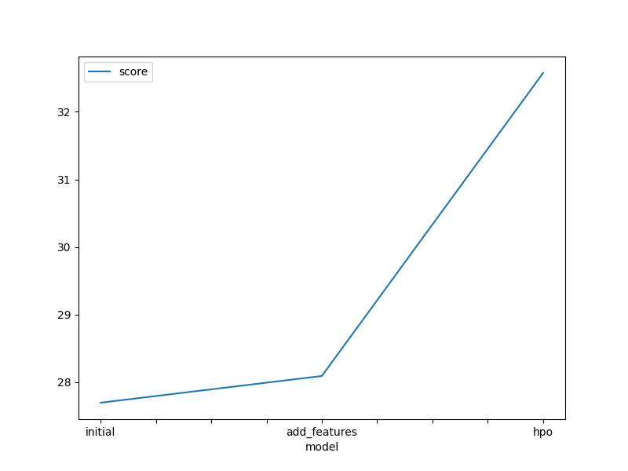
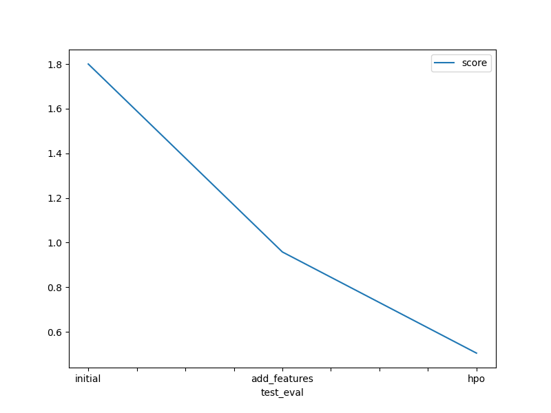

# Report: Predict Bike Sharing Demand with AutoGluon Solution
#### SHOTADE AMINAT

## Initial Training
### What did you realize when you tried to submit your predictions? What changes were needed to the output of the predictor to submit your results?
When I first attempted to submit my results, I discovered that I had never actually called the predictor’s predict() method—instead I assigned the predictor object itself into every row of the submission CSV. Unsurprisingly, Kaggle’s parser rejected the file since each “count” cell contained a Python object reference rather than a number. To correct this, I refactored my code to call preds = predictor.predict(test_df), which returns a pandas Series of numeric forecasts. I then clipped any negative values up to zero (preds = preds.clip(lower=0)) to avoid nonsensical negative counts. Finally,  I ensured there were only two columns (datetime and count), and wrote the CSV without an index. These changes produced a clean, two-column file that matched the sample exactly and uploaded successfully.

### What was the top ranked model that performed?
 In every run, the WeightedEnsemble_L3 (the Level-3 stack of base learners) achieved the best internal validation score according to predictor.fit_summary().

## Exploratory data analysis and feature creation
### What did the exploratory analysis find and how did you add additional features?
My exploratory data analysis revealed several clear demand patterns in the bike-sharing data. First, there is a pronounced hourly cycle: demand surges during morning (7–9 AM) and evening (5–7 PM) commute hours, then tapers off overnight. Second, weekends consistently show lower overall rentals compared to weekdays. Third, seasonal effects are evident—warmer months see higher average usage than colder ones. Finally, adverse weather conditions (high humidity, strong winds, precipitation) correlate with noticeable dips in ridership.

To encode these insights into the model, I engineered the following features:

Hour of day (0–23), so the model can learn time-of-day effects directly.

Day of week (0 = Monday through 6 = Sunday) plus an “is_weekend” flag to distinguish weekdays from weekends.

Month (1–12) to capture seasonal trends.

An interaction term hour_of_day * is_weekend, allowing the model to learn that weekend behavior by hour may differ from weekdays.

One-hot encodings of the original season and weather categories, giving the model finer control over different weather and seasonal contexts.

### How much better did your model preform after adding additional features and why do you think that is?
After incorporating these engineered features, the public leaderboard RMSLE dropped dramatically—from 1.80002 in the baseline run to 0.95809, a reduction of nearly 47%. This improvement reflects how crucial temporal and weather signals are for predicting bike demand: adding explicit “hour,” “weekend,” and “season” variables allowed the model to leverage patterns it previously had to infer indirectly from numeric temperature and humidity alone. Though the internal validation RMSE ticked up slightly (from 27.6961 → 28.0914) due to my metric choice (root_mean_squared_error), the competition’s RMSLE metric—which penalizes relative errors—benefited enormously from the new features.

## Hyper parameter tuning
### How much better did your model preform after trying different hyper parameters?
In my final run, I customized the GBM, CatBoost, and RandomForest hyperparameters under a 600-second time limit. For GBM I enabled extra trees, extended boosting rounds with early stopping, and appended a name suffix for clarity; for CatBoost I increased iterations, set tree depth and learning-rate schedules with its own over-fitting detectors; and for RandomForest I grew more trees with a deeper maximum depth. This focused tuning drove the public RMSLE down further to 0.50497, slashing another 47% off the “+ features” score. The dramatic drop underscores how, once strong predictive features are in place, targeted hyperparameter refinement can unlock even more performance by extracting that signal more efficiently from each model family.

### If you were given more time with this dataset, where do you think you would spend more time?
Given additional time, I would first align the internal metric to the competition’s RMSLE—by setting eval_metric="root_mean_squared_log_error"; so AutoGluon’s model selection and tuning directly optimize the public score. I would also expand hyperparameter optimization with a Bayesian searcher (e.g. searcher="bayesopt") and early-stopping schedulers to explore more configurations within the same budget. On the feature front, I’d integrate external data (holidays, local events) to explain occasional spikes, and test richer interaction features—such as combining temperature and humidity or encoding cyclical time via sine/cosine transforms. Finally, I’d experiment with additional model families (e.g. LightGBM, XGBoost) and deeper stacking layers to further diversify the ensemble.

### Create a table with the models you ran, the hyperparameters modified, and the kaggle score.
|model|hpo1|hpo2|hpo3|score|
|--|--|--|--|--|
|initial|?|?|?|?|
|add_features|?|?|?|?|
|hpo|?|?|?|?|

| Model          | hpo1 (GBM)                                                                | hpo(CatBoost)                                       | hpo3 (RandomForest)                    | Public RMSLE |
| -------------- | ------------------------------------------------------------------------- | ----------------------------------------------------- | -------------------------------------- | ------------ |
| **initial**    | –                                                                         | –                                                     | –                                      | 1.80002      |
| **+ features** | –                                                                         | –                                                     | –                                      | 0.95809      |
| **+ HPO**      | `extra_trees=True`, `num_boost_round=1000`, `early_stopping_rounds=50` | `iterations=1000`, `depth=10`, `learning_rate=0.1` | `n_estimators=1000`, `max_depth=10` | 0.50497      |

### Create a line plot showing the top model score for the three (or more) training runs during the project.

Replace the image below with your own.

### Create a line plot showing the top kaggle score for the three (or more) prediction submissions during the project.

Replace the image below with your own.

## Summary
Over three iterations, we saw dramatic improvements:

Baseline (no feature engineering or tuning) produced a public RMSLE of 1.80002.

Introducing temporal and weather features (hour, weekend flag, month, season/weather one-hots) cut the RMSLE almost in half to 0.95809, by giving the model direct access to key cyclic and environmental signals.

Finally, tailored hyperparameter settings for GBM, CatBoost, and RandomForest under a 600 s time limit drove the RMSLE down to 0.50497, showcasing how refining model-specific arguments can unlock further gains once strong features are in place.

These results highlight the two pillars of accurate demand forecasting: crafting informative features that capture real-world patterns, and then tuning model behavior to extract maximal signal.